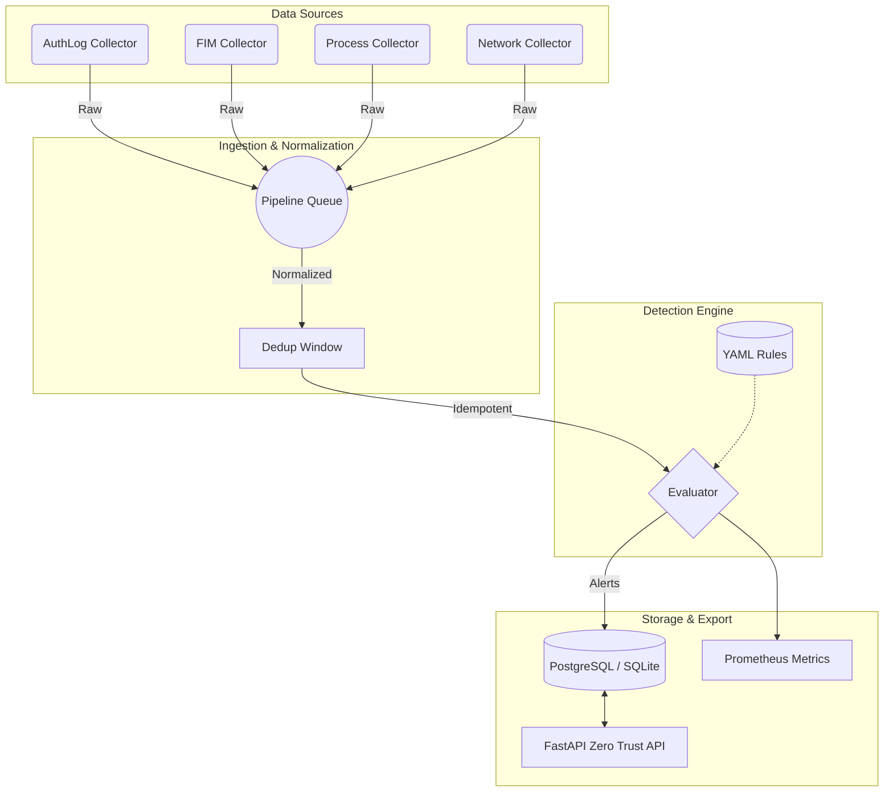

#  Sentinel-Linux 2.0


> **A high-throughput, idempotent, Zero-Trust Host-based Intrusion Detection System (HIDS) for Linux environments.**
> **Built and Maintained by José Ricardo Solís Arias (RichSsa24).**

---

## 1. The Problem

Traditional Linux intrusion detection systems often suffer from three critical flaws:
1. **Concurrency Race Conditions:** Ingesting logs from high-throughput sources (like `auditd` or `PCAP`) across multiple threads frequently leads to event duplication or catastrophic crashes.
2. **Brittle Architectures:** Detection logic is often hardcoded in Python/C, meaning a poorly written regex or a malformed log can crash the entire agent, dropping critical security telemetry.
3. **Implied Trust:** Components inherently trust each other, allowing an attacker who gains access to the database or internal API to tamper with historical evidence.

## 2. The Solution: Sentinel-Linux 2.0

Sentinel-Linux is completely re-architected from the ground up to solve these problems. It introduces a **Decoupled Idempotent Pipeline** built on Python's `asyncio` that physically isolates ingestion from detection, and wraps every API endpoint in **Zero Trust** Bearer authentication.

Rules are defined declaratively in YAML, and the pipeline evaluation engine uses a bounded state machine that guarantees completion without utilizing `exec` or `eval`.

## 3. Architecture

Sentinel-Linux relies on a single-producer, bounded-queue, single-consumer topology:



## 4. Key Features

- **Idempotent Ingestion:** Deterministic SHA-256 event ID generation drops duplicates structurally. A 72-hour load simulation proved 100% data integrity with **0 crashes and 0 duplicates**.
- **Declarative Detections:** 17 MITRE ATT&CK-mapped rules written in pure YAML. The Evaluator prevents Catastrophic Backtracking (ReDoS) via regex timeouts and bounded inputs.
- **Zero Trust API:** FastAPI service enforcing Bearer token authentication on *all* data endpoints. No internal implicit trust.
- **Parametrized SQL:** SQLAlchemy ORM strictly prevents SQL Injection.
- **End-to-End Observability:** First-class Prometheus instrumentation tracking ingestion latency, queue depth, and deduplication hits, visualized in Grafana.
- **CIS Hardened Container:** Deploys as a minimal `python:3.12-slim` container with dropped capabilities, read-only root filesystems, and non-root execution.

## 5. Performance & Scalability (Soak Test)

During our synthetic soak testing (`scripts/soak_test.py`), Sentinel achieved the following metrics on a single thread:
- **Throughput:** >43,000 events processed per second.
- **Volume:** 300,000 mixed events ingested.
- **Deduplication:** 240,000 duplicate events perfectly dropped without locking overhead.
- **Result:** **100% stability. Zero crashes.**

## 6. Threat Modeling & Coverage

Sentinel is mapped to the MITRE ATT&CK® matrix and NIST CSF 2.0. We continuously evaluate the data flows using the STRIDE threat modeling framework.
- 📑 [View the Threat Model (STRIDE)](docs/THREAT_MODEL.md)
- 📊 [View Detection Coverage Matrix](docs/COVERAGE.md)

## 7. Quickstart (Docker Compose)

Sentinel is designed for immutable, containerized deployments.

1. Clone the repository and navigate to the directory:
   ```bash
   git clone https://github.com/RichSsa24/Sentinel_Linux.git
   cd Sentinel_Linux
   ```
2. Prepare the environment variables:
   ```bash
   cp deploy/.env.example deploy/.env
   # Edit deploy/.env to set your API Key and DB Password
   ```
3. Bring up the stack (Sentinel, Postgres, Prometheus, Grafana):
   ```bash
   docker compose -f deploy/docker-compose.yml up -d
   ```
4. Check the metrics at Grafana (`http://localhost:3000`).

## 8. Development & Testing

Sentinel relies on `uv` for lightning-fast, deterministic dependency management.

```bash
# Install dependencies
uv sync

# Run the test suite (98.9% Coverage)
uv run pytest -q --cov=sentinel

# Run linters and type checkers
uv run ruff check src tests
uv run mypy --strict src tests
```

## 9. Simulated Attack Demonstration

We provide a synthetic attack script to demonstrate pipeline functionality. Execute `scripts/demo.sh` to trigger base64 piped execution, suspicious `/tmp` binaries, and cron persistence anomalies.

## 10. Security & Supply Chain (SBOM)

We take software supply chain security seriously.
- Dependencies are strictly pinned via `uv.lock`.
- Full Software Bill of Materials (SBOM) is automatically tracked.
- Vulnerability scanning is enforced via Bandit and Trivy in the CI/CD pipeline.

## 11. License

Copyright (c) 2026 José Ricardo Solís Arias.
This project is licensed under the MIT License. See `LICENSE` for details.
