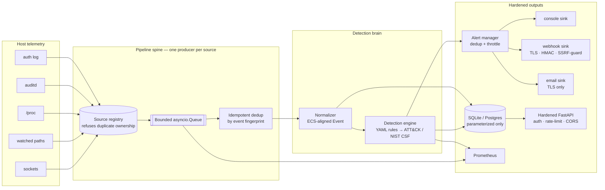

# ADR 0001 — Architecture Overview

- **Status:** accepted
- **Date:** 2026-06-16
- **Deciders:** José Ricardo Solís Arias
- **Phase:** 0

## Context

Sentinel-Linux 2.0 is a rebuild of a v1 host-security monitor that shipped
with a **double-collection race condition**: two threads concurrently read
the same source, producing duplicate, out-of-order events and intermittent
crashes. The rebuild exists not just to add features but to demonstrate
engineering judgment — specifically a clean separation of concerns and a
concurrency model in which the v1 bug is structurally impossible.

This ADR records the top-level architecture that subsequent phases will
implement.

## Decision

The system is a single-binary, async Python service with seven layers,
each with a single responsibility and a narrow interface to the next:

### Layers

1. **Collectors** — each owns exactly one source and is the only producer
   of raw events from that source (enforced by the source-ownership
   registry). Least-privilege at the OS level; degrade safely on permission
   denial; never trust the bytes they read.
2. **Pipeline spine** — a bounded `asyncio.Queue` between collectors and
   the rest of the system. Backpressure is explicit: a full queue blocks
   producers, never silently drops events.
3. **Dedup** — every event carries a deterministic fingerprint
   (`sha256` over identity fields). The deduplicator is idempotent on
   that key; even a hypothetical double-emit cannot reach downstream.
4. **Normalizer** — converts each collector's raw output into one
   immutable, ECS-aligned `Event`. Unmappable input is dead-lettered.
5. **Detection engine** — evaluates events against declarative YAML
   rules with an allowlisted operator grammar. **Rules are data, never
   code.** Each rule maps to ATT&CK technique IDs and NIST CSF 2.0
   categories.
6. **Alert manager + sinks** — three hardened channels (console, webhook,
   email) with per-rule deduplication and throttling. Outbound I/O
   verifies TLS, signs with HMAC where supported, and blocks SSRF to
   internal/loopback/link-local ranges unless explicitly allowed.
7. **Persistence, API, observability** — SQLAlchemy (async, parameterized
   only) → SQLite default / PostgreSQL via env; FastAPI read surface
   following OWASP API Security Top 10 (auth on every data endpoint,
   rate-limit, CORS allowlist, generic errors); Prometheus metrics and
   provisioned Grafana dashboards.

### The race-condition kill (the engineering story)

The v1 bug was structural: two threads owning the same source plus a
shared mutable buffer with no enforced ordering. The 2.0 design removes
every ingredient:

| v1 ingredient                             | 2.0 fix                                       |
|-------------------------------------------|-----------------------------------------------|
| Two threads reading one source            | **One producer per source**, enforced by a registry that raises on duplicate ownership |
| Shared mutable buffer                     | **Bounded `asyncio.Queue`** owned by the pipeline; producers never touch processor state |
| No ordering guarantees                    | Per-source FIFO via the single-producer invariant; explicit, documented locks elsewhere |
| Silent duplicate emission on the seam     | **Idempotent dedup** keyed on deterministic fingerprint; property-tested |
| Drop-on-shutdown                          | **Graceful drain** on SIGTERM/SIGINT; queue flushes, sinks flush, exit clean |

A dedicated test in Phase 1 reproduces the v1 stress pattern and asserts
exactly-once delivery. If that test cannot be made to pass, the
architecture is wrong and gets fixed before any later phase begins.

## Consequences

- **Positive:** the most-cited engineering failure of v1 becomes the most
  visible engineering win of 2.0, with a test as proof. Layered design
  makes Phases 2–8 incremental and reviewable.
- **Negative:** async-throughout demands strict discipline (no blocking
  I/O in the event loop; every external call must be async or wrapped).
  This raises the bar for contributors but is non-negotiable for
  correctness.
- **Trade-off:** Python is slower than Go or Rust for raw throughput,
  but its detection/parsing ecosystem (pydantic, PyYAML, structlog,
  Sigma-style declarative rules) and recruiter-facing readability make
  it the right portfolio choice. If sustained throughput becomes a
  bottleneck in the soak test, the collectors are the candidates for a
  Cython/Rust extension — explicitly out of scope for v1.0.

## Frameworks honored

- **OWASP** Top 10 / API Top 10 / ASVS — application tier.
- **NIST CSF 2.0** — every detection rule tagged to a function/category.
- **NIST SP 800-207 (Zero Trust)** — applied to Sentinel's own internal
  trust model (see §3.2 of the build directive).
- **MITRE ATT&CK / D3FEND** — detection rule mappings.
- **CIS Benchmarks** — container hardening in Phase 7.
